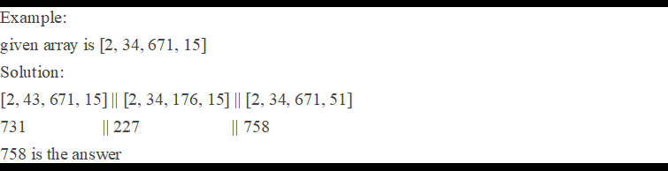

1) reverse number using simple java and stream and Collections.reverse.
2) sort using simple java and stream and comparable.
3) find second max salary or nth max.
4) There is list of names and process each name using separate thread using CompletableFuture.
5) Solid principles:
   5) Solid-S Single Responsibility Principle 
   6) Solid-O Open/Closed Principle
   7) Solid-L Liskov Substitution Principle
   8) Solid-I Interface Segregation Principle (ISP)
   9) Solid-D Dependency Inversion Principle
6) Generate and consume data using flux but publisher should wait if queue does not have space.
7) Write BinaryOperator 
        b) BinaryOperator<T> is a functional interface in Java 
           (from java.util.function package) that takes two arguments of the same type
           and returns a result of the same type. It extends BiFunction<T, T, T>, meaning both 
           input and output must be of the same type. 
8) Given a String ("hello jake, how are you?") , convert to Camel Case ("Hello Jake, How Are You?").
9) Implement an algorithm to check if a string has all unique characters.
        String[] words = {"abcde", "hello", "apple", "kite", "padle"} 
10) find max sum in given array and one time only one number can reverse in a loop :
    
    Example:
    given array is [2, 34, 671, 15]
    Solution:
    [2, 43, 671, 15] || [2, 34, 176, 15] || [2, 34, 671, 51]
    731		   || 227		  || 758
    758 is the answer

11) print lucky string (delloite)
    divide the string until it is not devidable
    Example: fourhead
    four || head
    fo || ur || he || ad

12) Find location of 50 Using Binary Search in given array
    [10, 20, 30, 40, 50, 60, 70]
    Binary Search only beneficial when array is sorted.

